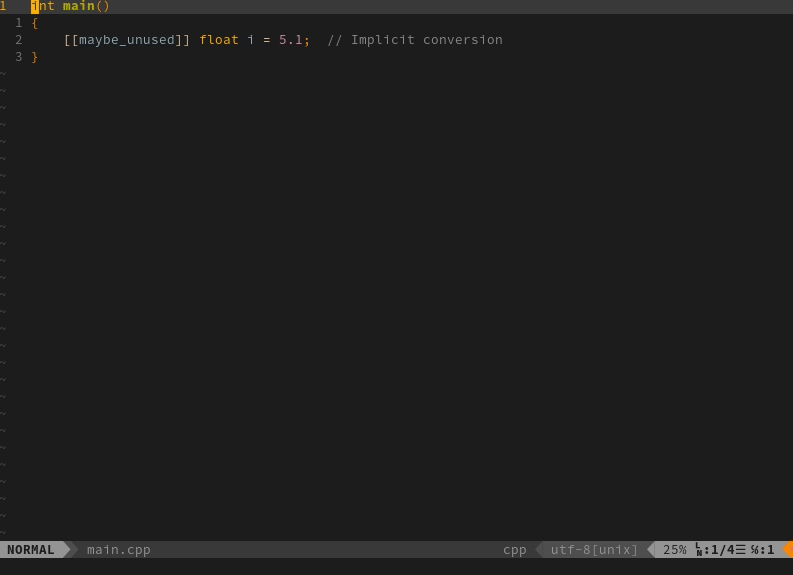

# floaterm-gf

Enabling `gf` and `gF` in floaterm such that the file under the cursor will be
opened in a normal window (as opposed to the floating window wrapping the
terminal emulator.

## Customization

By default, `gf` and `gF` are mapped to `go to file` and `go to file and line`,
respectively, but you can override these by creating your own mappings:

```
nnoremap <your_own_mapping_gf> <Plug>FloatermGotoFile;
nnoremap <your_own_mapping_gF> <Plug>FloatermGotoFileAndLine;
```


